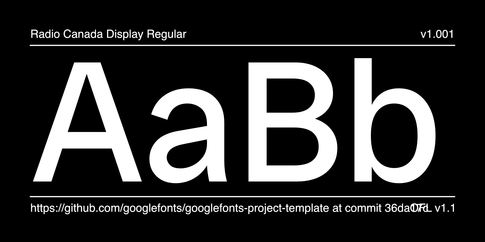
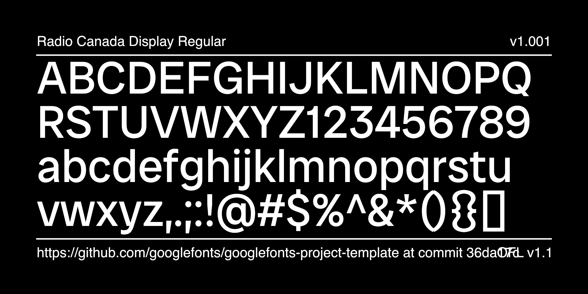

# Oswald

[![][Fontspector]](https://alexeiva.github.io/Oswald4/fontspector/fontspector-report.html)
[![][OpenType]](https://alexeiva.github.io/Oswald4/fontspector/fontspector-report.html)
[![][Universal]](https://alexeiva.github.io/Oswald4/fontspector/fontspector-report.html)
[![][Google Fonts]](https://alexeiva.github.io/Oswald4/fontspector/fontspector-report.html)
[![][Glyphset]](https://alexeiva.github.io/Oswald4/fontspector/fontspector-report.html)

[Fontspector]: https://img.shields.io/endpoint?url=https%3A%2F%2Falexeiva.github.io%2FOswald4%2Fbadges%2FFontspectorQA.json
[OpenType]: https://img.shields.io/endpoint?url=https%3A%2F%2Falexeiva.github.io%2FOswald4%2Fbadges%2FOpentypeSpecificationChecks.json
[Universal]: https://img.shields.io/endpoint?url=https%3A%2F%2Falexeiva.github.io%2FOswald4%2Fbadges%2FUniversalProfileChecks.json
[Google Fonts]: https://img.shields.io/endpoint?url=https%3A%2F%2Falexeiva.github.io%2FOswald4%2Fbadges%2FFontFileChecks.json
[Outline Correctness]: https://img.shields.io/endpoint?url=https%3A%2F%2Falexeiva.github.io%2FOswald4%2Fbadges%2FOutlineCorrectnessChecks.json
[Glyphset]: https://img.shields.io/endpoint?url=https%3A%2F%2Falexeiva.github.io%2FOswald4%2Fbadges%2FGlyphsetChecks.json

Description of your font goes here. We recommend to start with a very short presentation line (the kind you would use on twitter to present your project for example), and then add as much details as necesary :-) Origin of the project, idea of usage, concept of creation… but also number of masters, axes, character sets, etc.

Don't hesitate to create images!

## About

Oswald is a reworking of the classic gothic typeface style historically represented by designs such as 'Alternate Gothic'. The characters of Oswald have been re-drawn and reformed to better fit the pixel grid of standard digital screens. Oswald is designed to be used freely across the internet by web browsers on desktop computers, laptops and mobile devices.

## Building

Fonts are built automatically by GitHub Actions - take a look in the "Actions" tab for the latest build.

If you want to build fonts manually on your own computer:

- `make build` will produce font files.
- `make test` will run [FontBakery](https://github.com/googlefonts/fontbakery)'s quality assurance tests.
- `make proof` will generate HTML proof files.

The proof files and QA tests are also available automatically via GitHub Actions - look at `https://yourname.github.io/your-font-repository-name`.

## Changelog

### Completed tasks:
- Converted project files to .glyphs
- Fixed tasks listed in [ProjectChecklist.md](https://github.com/googlefonts/gf-docs/blob/main/ProjectChecklist/README.md) and internal planning spreadsheet.
- Corrected OpenType features
- Changed upm from 2048 to 1000
- Fix glyphs, anchors and components
- Fix MM compatibility
- Add instances
- Vertical Metrics

### Todo:
- Improve README.md
- Intelligently import .fea file so we get kern classes
- Run fonts through Font bakery and Ship fonts

## License

This Font Software is licensed under the SIL Open Font License, Version 1.1.
This license is available with a FAQ at https://openfontlicense.org

## Repository Layout

This font repository structure is inspired by [Unified Font Repository v0.3](https://github.com/unified-font-repository/Unified-Font-Repository), modified for the Google Fonts workflow.
